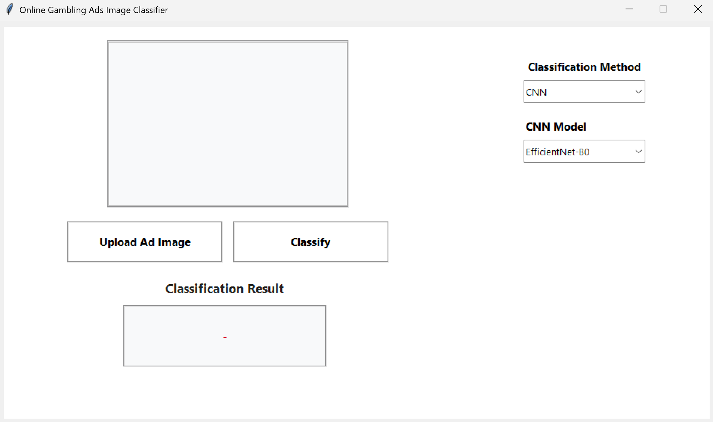
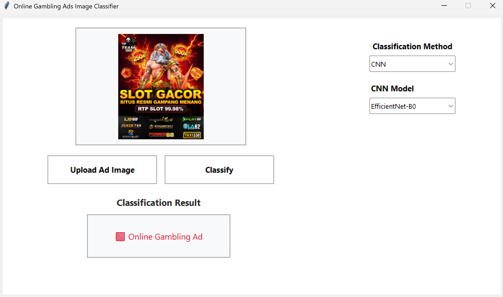
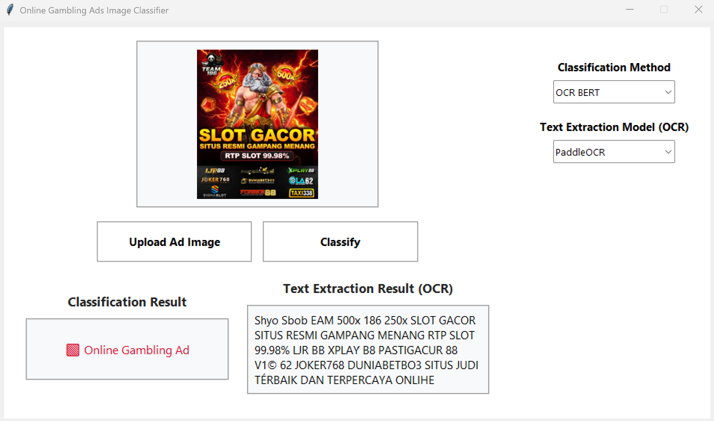
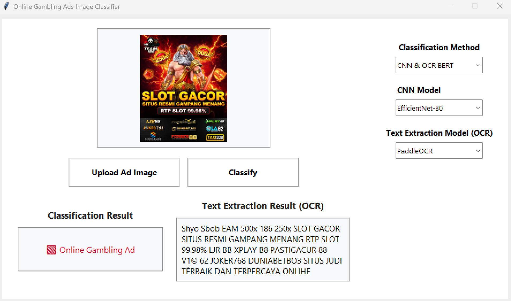

# Online Gambling Ads Image Classifier

This project is a desktop application designed to classify images to determine if they are advertisements for online gambling. It utilizes a graphical user interface (GUI) and employs various deep learning models, including CNNs for image classification, OCR for text extraction, and BERT for text classification. The application also features a fusion mechanism to combine the results from different models for a more accurate and robust prediction.

## Features

- **User-Friendly GUI**: An intuitive interface built with Tkinter for easy image uploading and classification.
- **Multiple Classification Methods**:
    - **CNN**: Classifies the image based purely on visual features.
    - **OCR BERT**: Extracts text from the image and classifies the image based on the extracted text.
    - **CNN & OCR BERT (Fusion)**: Combines the predictions from both methods for a comprehensive analysis.
- **Flexible Model Selection**:
    - **CNN Models**: Choose between `EfficientNet-B0` and `ResNet-50`.
    - **OCR Engines**: Select either `PaddleOCR` or `EasyOCR` for text extraction.

## Project Structure
```
Online-Gambling-Ads-Image-Classifier/
├── models/
│   ├── CNN/
│   │   ├── EfficientNet-B0_final_model.pt
│   │   └── ResNet-50_final_model.pt
│   └── OCR_BERT/
│       ├── EasyOCR_BERT/
│       └── PaddleOCR_BERT/
├── modules/
│   ├── image_classification.py
│   ├── text_extraction.py
│   ├── text_classification.py
│   ├── fusion.py
│   └── gui.py
├── screenshots/
│   ├── main.png
│   ├── 1.png
│   ├── 2.png
│   └── 3.png
├── main.py
├── requirements.txt
└── README.md
```

## Models Used

The application leverages several pre-trained and fine-tuned models to perform the classification task.

### 1. Image Classification (CNN)
These models analyze the visual patterns of an image to make a prediction. The trained models are included in the `models/CNN/` directory.
- **EfficientNet-B0**: A state-of-the-art model known for its high accuracy and efficiency.
- **ResNet-50**: A classic and powerful deep residual network.

### 2. Text Classification (OCR BERT)
This two-step method first extracts any text present in the image and then classifies it.
- **OCR (Optical Character Recognition)**:
    - **PaddleOCR**: A powerful multilingual OCR toolkit.
    - **EasyOCR**: A popular and easy-to-use OCR library.
- **BERT (Bidirectional Encoder Representations from Transformers)**:
    - After text is extracted, a fine-tuned BERT model classifies it as either related to online gambling or not. The models are specific to the OCR engine used.

### 3. Fusion Method
When the "CNN & OCR BERT" mode is selected, the application uses a fusion algorithm to weigh the predictions from both the CNN and BERT models, producing a single, more reliable final result.

## Model Performance
The following table shows the performance of the models on the test set.

| Model                                         | Accuracy | Precision | Recall | F1-Score |
| --------------------------------------------- |:--------:|:---------:|:------:|:--------:|
| **EfficientNet-B0**                           |  94.00%  |   92.80%  | 95.40% |  94.10%  |
| **ResNet-50**                                 |  94.10%  |   93.49%  | 94.80% |  94.14%  |
| **PaddleOCR BERT**                            |  97.60%  |   97.60%  | 97.60% |  97.60%  |
| **EasyOCR BERT**                              |  96.81%  |   96.80%  | 96.80% |  96.80%  |
| **Fusion (EfficientNet-B0 & PaddleOCR BERT)** |  96.40%  |   99.79%  | 93.00% |  96.27%  |
| **Fusion (EfficientNet-B0 & EasyOCR BERT)**   |  96.10%  |   99.36%  | 92.80% |  95.97%  |
| **Fusion (ResNet-50 & PaddleOCR BERT)**       |  96.00%  |   99.57%  | 92.40% |  95.85%  |
| **Fusion (ResNet-50 & EasyOCR BERT)**         |  96.00%  |   99.57%  | 92.40% |  95.85%  |


## How to Run the Application

Follow these steps to set up and run the project on your local machine.

### Prerequisites

- Python 3.8+
- Git

### Step 1: Clone the Repository
Clone this repository to your local machine using the following command:
```bash
git clone https://github.com/MuhLibri/Online-Gambling-Ads-Image-Classifier.git
cd Online-Gambling-Ads-Image-Classifier
```

### Step 2: Install Dependencies
Install all the required Python libraries using the `requirements.txt` file. It is recommended to use a virtual environment.
```bash
# Create and activate a virtual environment (optional but recommended)
python -m venv venv
source venv/bin/activate  # On Windows, use `venv\Scripts\activate`

# Install the packages
pip install -r requirements.txt
```

### Step 3: Download the OCR_BERT Models
The fine-tuned BERT models for text classification need to be downloaded manually.

1.  Download the models from the following link:
    https://drive.google.com/drive/folders/1FsR4MQOuJBA3tSV_YAKWSLCiAgJczvM7?usp=sharing

2.  Extract the downloaded archive. You will find two folders: `EasyOCR_BERT` and `PaddleOCR_BERT`.

3.  Place these two folders inside the `models/OCR_BERT/` directory. The final structure should look like this:
    ```
    models/
    └── OCR_BERT/
        ├── EasyOCR_BERT/
        │   ├── config.json
        │   └── ... (other model files)
        └── PaddleOCR_BERT/
            ├── config.json
            └── ... (other model files)
    ```

### Step 4: Run the Application
Once the setup is complete, you can run the application by executing the `main.py` script:
```bash
python main.py
```
This will launch the GUI, where you can upload an image and start classifying.


## Dataset Used
The models were trained and evaluated using a custom dataset of images containing 5000 images in total consisted of two classes, online gambling ad and non-gambling ad. The dataset includes a diverse range of images to ensure robust model performance across different scenarios. 
Here are the dataset used to train and evaluate the models:
https://drive.google.com/drive/folders/1mCl9XgL7FtgqaJhkAGNC5xpeEpnsDDDY?usp=sharing

## Screenshot
Here is a preview of the application's interface and examples of classification results.

### Main Interface


### Classification Examples



